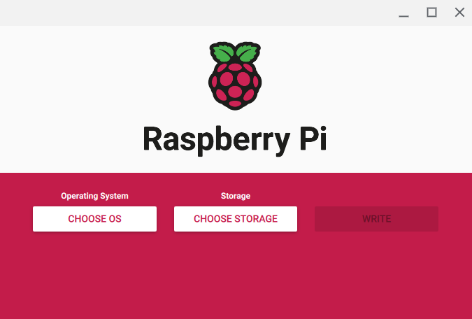
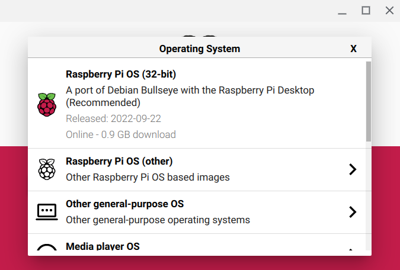

# Raspberry Pi

Wes Colemere

---

## What is a Raspberry Pi?

Raspberry Pi is a small computer meant to encourage people to learn how to code at an affordable price. <i>(So long as they're in stock)</i>

The best place to find one is on the official website: https://www.raspberrypi.com/. Here you can find official resellers for different areas of the world. It's worth noting that shops servicing foreign areas may occasionally have models in stock that your local retailers do not, or vice versa.

## Are there different kinds of Pis?

Rasberry Pi comes in a variety of shapes and sizes. You can view a full list of their products here: https://www.raspberrypi.com/products/. You'll notice that certain models follow specific naming schemes that do not match the others.
 

The basic Raspberry Pi is organized by generation and model: for example, the Raspberry Pi 3B is the second revision of the 3rd generation Raspberry Pi computer. Its successor, the Raspberry Pi 3B+, is the final revision of the 3rd generation Raspberry Pi computer. Higher numbers indicate more recent generations of hardware and letters and '+' signs indicate revision and format (you'll notice that A+ models differ in soldered on hardware from B+ models).

The Raspberry Pi Foundation also makes several other 'flavors' of Raspberry Pi. The Raspberry Pi Zero, for example, is an extra small version of the Raspberry Pi computer. It can indeed be used as a computer the same way that a regular Pi would be, albeit with less powerful components. The Raspberry Pi Zero W is the same, except that it also has wireless capabilities. The Raspberry Pi Pico is another exciting flavor in the form of a microcontroller for embedded systems. This means that it is designed specifically for usage in applications such as thermostats, smart cameras, automated pet feeders, and so on.

There are also other kinds of of hardware that the Raspberry Pi Foundation offers for more specific applications. The Raspberry Pi 400 is a Raspberry Pi 4B inside of a keyboard, meant for lightweight desktop use. The Compute Module is a unique format designed for embedded systems and scientific applications. People do cool things with these. 

## Which one do I get?

The first thing to do is to ask <i> what do I want to do.</i> The latest Raspberry Pi model may have more resources than you need if you wanted to, for example, create a website. This means that you will likely need to investigate the computing requirements of your project. For most applications, a basic Raspberry Pi (e.g. RPi 4B, RPi 3, etc.) will suffice. Finding an RPi nowdays can be rather difficult; this website is a helpful resource for finding retailers with Pis in stock: https://rpilocator.com/

## How do I start using my RPi?

In order to start using your Raspberry Pi you will need to 'flash' an operating system onto the Pi. The easiest way to do this is to connect your RPi to a computer via a USB cable connected to the power connector on the RPi (this is the USB-C connector on the Raspberry Pi 4B).

Once your RPi is connected to your computer, you may begin flashing you RPi by using an SD card imager, we recommend using the official Raspberry Pi Imager: https://www.raspberrypi.com/software/ (There are other imagers you may use, though the official imager is easiest to use).

Raspberry Pi Imager will present you with the following menu:

The first button will allow you to select an operating system from officially supported images (you may also select an operating system from an image saved on your own computer, but this may require additional configuration). The menu will show you a recommended image, likely a version of Raspberry Pi OS, for installation (Note: this may vary from system to system). For this tutorial, we will use this image.

The next button will allow you to select a drive for installation. Raspberry Pi Imager is set up such that it will likely select your intended drive for you or show your SD card as the only available drive for imaging. Select the drive you intend to write your image to.

